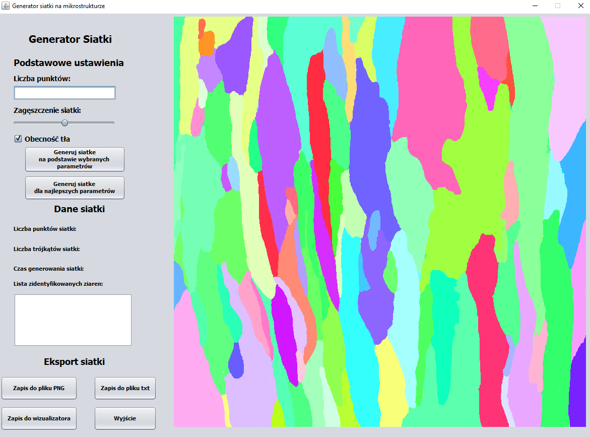

# Computational-Geometry-MeshGenerator-Delaunay
An Application which was a project for one of the subjects realized during the studies - computational geometry. 

## Table of contents
* [General info](#general-info)
* [Applied algorithms](#applied-algorithms)
* [Screenshots](#screenshots)
* [Technologies](#technologies)
* [Features](#features)
* [Status](#status)

## General info
An Application which was a project for one of the subjects realized during the studies - computational geometry. 
The purpose of the application was to create a mesh on an example microstructure (composed of grains), based on the colors of individual grains.
The process of creating a mesh is based on the colors of individual grains and generated points (random but from a specific pool of points - described below), 
located within the microstructure image (within the png file). The mesh creation itself takes place with the use of two algorithms, 
thanks to which it allows to base both on the strictly defined parameters declared in the code, and on the parameters specified by the user,
through the components available in the left panel (left part of the program). 
The algorithms on which the application is based are described in the Applied algorithms section. 
>
## Applied algorithms
*Sobel Edge Detection (Sobel filter) 
>
A simplified version based on the colors (gray) of individual pixels. Used in the first stage of mesh creation to determine the edges
(which are a very large list of points) of each grain based on the change in the shade of gray. 
The use of the algorithm makes it possible to easily generate a set of points for the next algorithm,
(Delaunay Triangulation, which is used to create a mesh composed of triangles at a later stage). 
The use of this algorithm also allows to obtain a clear visualization of the generated mesh in an external program (based on edges - i.e. a list of points). 
>
*Delaunay Triangulation 
>
Algorithm used to create the correct, final triangular mesh.

## Main panel appearance

## Technologies
* Java
* Swing

## Features
List of working features:
* Generating a mesh on the microstructure presented in the course, based on the most optimal set of parameters. 
* Generating a mesh on any microstructure, based on parameters specified by the user (number of points, density / accuracy, filling). The greater the number of points and the greater the density - the better the mesh quality / accuracy, but also the greater the computational and memory costs (the greater the number of
points and created triangles). 
* Print information about the current mesh data, such as the number of points included in the mesh, the number of mesh triangles, and the mesh generation time.
* List of identified grains (Based on the color shade. Grain identification, due to the specificity of the selected color recording model (RGB), is carried out with a tolerance expressed as a percentage (default is set to 12%), so as to identify all grains that are actually visible on the presented microstructure, instead of relying only on numbers). 
* Each grain has its own ID (generation method described above) and each record is marked with an appropriate color that corresponds to the color contained in the microstructure. 
* Export / Save the generated mesh to a PNG file.
* Export / Save the generated mesh to a text file (txt). 
* Export / Save the generated mesh to the visualizer (tested in MeshLab). 

## Status
The project will not be developed due to outdated technology.

## Appearance of application
* [Generated mesh - preview in the application ](./images/generating-result.png)
* [Generated mesh](./images/generated-mesh.png)
